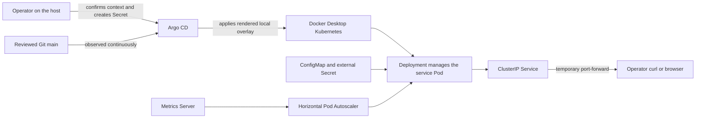

<!-- reader-first-readme:v1 -->

# Containerised Service Kubernetes and GitOps

This repository is the Kubernetes desired-state and GitOps operations half of
the Containerised Service case study. It deploys a small HTTP service from its
separate application repository to a Docker Desktop Kubernetes cluster. A
reviewed Git change is rendered by Kustomize and reconciled by Argo CD; this
repository does not build the application image.

## What it does

The project deploys the HTTP service to Docker Desktop's local Kubernetes
cluster. It defines:

- a Kubernetes Deployment and Service;
- liveness and readiness probes for `GET /health`;
- runtime configuration through a ConfigMap and references to externally
  supplied Secrets;
- resource requests and limits, a restricted security context, NetworkPolicy,
  and horizontal scaling;
- Kustomize bases and environment overlays;
- pull-request checks that render and validate the desired state; and
- an Argo CD application with documented synchronization and rollback.

The deployed service exposes `GET /health`, `GET /version`, and
`GET /config-summary`. Its source and container build remain in the separate
[`containerised-service-cicd`](https://github.com/abdalrahmanattya/containerised-service-cicd)
application repository.

## At a glance

This repository is for the person responsible for changing where and how the
service runs. Instead of changing a live cluster by hand, the operator proposes
a small Git change. Automated checks inspect the resulting Kubernetes
configuration, a reviewer approves it, and Argo CD makes the local cluster match
that reviewed record.

| Stage | What it gives the operator |
| --- | --- |
| Describe | Reusable Kubernetes settings plus clear local and staging differences |
| Review | A pull request showing the exact desired-state change before deployment |
| Validate | Automated rendering, schema, security, and secret-safety checks |
| Reconcile | Argo CD continuously compares reviewed Git state with the local cluster |
| Recover | A normal Git revert restores the last known-good configuration |

## Operator journey

Imagine that a new service image is ready. The operator updates its immutable
image digest in a feature branch and opens a pull request. CI renders both
environment overlays and rejects malformed or unsafe configuration. After the
change is reviewed and merged, Argo CD notices the new Git revision and updates
the Docker Desktop Kubernetes cluster. The operator checks rollout status and
the service endpoints. If the image cannot start, events identify the failure
and a reviewed Git revert returns the cluster to the known-good revision.

Together, the application and this repository form the **Secure Container
Delivery & GitOps** case study. The application repository owns source, tests,
image construction, scanning, and the multi-architecture GHCR release. This
repository owns reviewed Kubernetes desired state, environment validation,
Argo CD reconciliation, and rollback.

## How it works

Kubernetes configuration is operational code. A wrong port, image tag, probe,
permission, or resource value can prevent a healthy application from serving
traffic. This repository makes those changes reviewable and provides an
evidence-based operating procedure using rendered manifests, pod status,
events, and logs before editing files.

The delivery path and ownership boundaries are shown below. The public
GitHub/GHCR boundary ends at desired state and an immutable image digest; the
local operator owns the kubeconfig, runtime Secret, Argo CD, and Docker Desktop
cluster.


The image is generated from the companion [Mermaid source](docs/architecture.mmd)
so the flow remains maintainable as the manifests evolve.

In plain language, the main path starts with a versioned application image in
GitHub Container Registry (GHCR). This repository records the exact image digest
and the settings Kubernetes should use. CI checks that record but cannot deploy
it. Argo CD reads the approved `main` branch, combines the reusable Kustomize
base with the local overlay, and asks Kubernetes to converge on that state.

### Local runtime diagram



This runtime diagram shows the components that operate on the developer's
machine. It is separate from the public delivery path above: Git and GHCR are
hosted, while Argo CD, Kubernetes, the runtime Secret, and service traffic stay
inside the local Docker Desktop environment.

## Technology in plain English

| Technology | Its job here |
| --- | --- |
| Kubernetes | Runs the container, checks its health, exposes it inside the cluster, and replaces unhealthy instances. |
| Kustomize | Combines a shared set of Kubernetes objects with the small differences for local or staging use. |
| Argo CD | Watches reviewed Git state and reconciles—meaning it brings—the cluster back to that state when they differ. |
| GHCR | GitHub Container Registry stores the versioned application image by an immutable digest. |
| Docker Desktop | Supplies the supported local Kubernetes cluster; no cloud account is needed. |
| Horizontal Pod Autoscaler (HPA) | Adjusts the number of service Pods within the configured one-to-three range using CPU measurements. |

### Cloud-resources diagram

There is no cloud compute, managed Kubernetes cluster, database, load balancer,
DNS zone, or paid infrastructure in this design. The relevant deployment view
is therefore the local runtime diagram above. GitHub hosts the public Git
repository and GHCR image; both are shown in the system architecture diagram.
No cloud resources are planned or deployed; the local components described
above were deployed and validated on Docker Desktop.

The diagrams use labelled neutral shapes rather than cloud-provider icons
because there is no cloud provider in scope. Product names refer to their
official projects: [Kubernetes](https://kubernetes.io/),
[Argo CD](https://argo-cd.readthedocs.io/),
[Docker](https://www.docker.com/), and
[GitHub](https://github.com/logos).
Official provider icon provenance is therefore not applicable to this
cloud-free runtime.

## Why this is useful

The reviewed Git record makes a deployment change understandable before it
reaches a cluster. The same record also gives operators a clear source for
diagnosis and recovery instead of leaving undocumented manual changes behind.

## Safety boundaries

- The supported target is a local Docker Desktop Kubernetes cluster only.
- No cloud cluster, paid service, or production environment is required.
- No token, password, kubeconfig, private key, or Secret value belongs in Git.
- Secret manifests may contain references or documented placeholders only.
- Cluster-changing commands require explicit approval of the command and local
  target before execution.
- GitHub publication and image publication use reviewed workflows and scoped
  repository permissions.

## Limitations and non-goals

- Managed or production Kubernetes, cloud-provider resources, or paid services.
- Public ingress, DNS, TLS certificates, or internet exposure.
- A service mesh, database, persistent storage, or automatic promotion between
  environments.
- Building application images or storing Secret values in this repository.

## Contributor workflow

A change owner:

1. changes an environment overlay on a feature branch;
2. opens a GitHub pull request;
3. reviews the rendered and validated manifests;
4. merges the approved desired-state change;
5. observes Argo CD synchronize the local cluster; and
6. verifies health, version, configuration, events, and rollout status.

## Testing and validation evidence

The recorded completion run validated both overlays, secret-pattern checks,
health/version/configuration endpoints, automatic scaling metrics, a deliberately
broken image rollout, diagnosis from Kubernetes events, and recovery through a
Git revert. The release evidence is summarized in [Release status](#release-status).

## Operator guide

The exact deployment method is the Docker Desktop, Argo CD, Kustomize, and
`kubectl` sequence below.

### Validate without changing a cluster

From the repository root, run the lightweight repository checks:

```sh
./scripts/test-overlays.sh
./scripts/check-public-secrets.sh
git diff --check
```

With kubectl, Kubeconform `0.8.0`, KubeLinter `0.8.3`, and Trivy `0.69.3`
installed, run the same complete validation shape used by CI:

```sh
./scripts/validate-manifests.sh
```

Expected result: both overlays render and the schema, security, configuration,
and public-secret checks pass.

### Set up the local deployment

The tested target is Docker Desktop Kubernetes. Every command in this section
changes that local cluster and should be run only after confirming the target:

```sh
kubectl config current-context
kubectl get nodes
```

Expected result: context `docker-desktop` and a Ready local node. Install Argo
CD `v3.5.0`, create the application namespace, and create your own runtime
Secret from a protected local file:

```sh
kubectl create namespace argocd
kubectl apply -n argocd --server-side --force-conflicts \
  -f https://raw.githubusercontent.com/argoproj/argo-cd/v3.5.0/manifests/install.yaml
kubectl create namespace containerised-service
kubectl -n containerised-service create secret generic containerised-service-runtime \
  --from-file=APP_RUNTIME_SECRET=/secure/local/path/app-runtime-secret
kubectl apply -f argocd/applications/containerised-service-local.yaml
```

The protected file contains a value chosen by the local operator; nobody needs
to send you a shared Secret. Do not place that file or its value in this
repository. The `APP_RUNTIME_SECRET` reference documents external Secret
handling and missing-Secret diagnosis; the simple service does not return or
log its value. Metrics-server is also required for HPA metrics. The pinned,
checksum-verified Docker Desktop procedure and its local-only TLS exception are
documented in [`docs/development.md`](docs/development.md#local-metrics-server).

Argo CD watches `main` and reconciles the local overlay. Allow its normal
repository refresh, then verify:

```sh
kubectl -n argocd get application containerised-service-local
kubectl -n containerised-service rollout status deployment/containerised-service
kubectl -n containerised-service get pods
kubectl -n containerised-service get hpa containerised-service
```

Expected result: the Application is `Synced` and `Healthy`, the Deployment is
Available, the pod is Ready, and the HPA has a CPU metric.

### Verify the service

Open a temporary local port-forward:

```sh
kubectl -n containerised-service port-forward service/containerised-service 8001:8000
```

In another terminal, run:

```sh
curl --fail http://127.0.0.1:8001/health
curl --fail http://127.0.0.1:8001/version
curl --fail http://127.0.0.1:8001/config-summary
```

Expected responses report healthy status, application version `0.1.3`, and the
local development configuration. Stop the port-forward with `Ctrl-C`.

### Diagnose a failed rollout

Gather evidence before editing desired state:

```sh
kubectl -n argocd get application containerised-service-local
kubectl -n containerised-service get deployment containerised-service
kubectl -n containerised-service get pods -o wide
kubectl -n containerised-service get events --sort-by=.metadata.creationTimestamp
kubectl -n containerised-service describe pod <pod-name>
kubectl -n containerised-service logs <pod-name>
kubectl kustomize apps/containerised-service/overlays/local
```

Compare Argo's Git revision, the rendered manifest, live image, pod state, and
Events. Logs may legitimately be unavailable when a container never starts.
Rank likely causes from this evidence, then make the smallest repair through a
reviewed pull request.

### Roll back through Git

Use a revert commit so history remains visible and Argo CD receives a reviewed
desired-state change:

```sh
git switch main
git pull --ff-only
git switch -c feature/rollback-<short-reason>
git revert <faulty-commit>
```

Push that branch, review and merge its pull request, then wait for Argo CD and
repeat the deployment and endpoint checks. For a merged pull request whose
merge commit must be reverted, use `git revert -m 1 <merge-commit>`. Do not use
`kubectl rollout undo` as the normal repair because Argo CD would treat that as
drift and restore Git's still-faulty state.

### Clean up the local cluster

First confirm context `docker-desktop`. These commands remove the Application,
workload namespace including its external Secret, metrics-server, and Argo CD:

```sh
kubectl delete -f argocd/applications/containerised-service-local.yaml
kubectl delete namespace containerised-service
kubectl delete -f /private/tmp/metrics-server-v0.9.0-components.yaml
kubectl delete namespace argocd
```

Run the metrics-server deletion only if the checksum-verified manifest still
exists at that path. Namespace deletion removes local data and is intentionally
separate from normal GitOps operation; review the targets before running it.

### Environment overlays

To inspect an environment without changing a cluster, render its Kustomize
overlay from the repository root:

```sh
kubectl kustomize apps/containerised-service/overlays/local
kubectl kustomize apps/containerised-service/overlays/staging
```

The `local` overlay uses one replica and `APP_ENV=development`. The `staging`
overlay uses two replicas and `APP_ENV=staging`. Both overlays preserve the
base selectors and probes and load `SERVICE_NAME`, `APP_ENV`, and `LOG_LEVEL`
from a generated ConfigMap.

The base also defines a token-disabled ServiceAccount, default-deny ingress,
same-namespace access to the service, and an HPA bounded to one through three
replicas. The HPA needs a metrics-server; the local Docker Desktop cluster may
not enforce NetworkPolicy, so those controls must be verified explicitly.

Both overlays reference an external Secret named
`containerised-service-runtime`; the Secret value is deliberately not stored
in this repository. Create it only in the target namespace from a protected
local file when deployment is approved:

```sh
kubectl -n containerised-service create secret generic containerised-service-runtime \
  --from-file=APP_RUNTIME_SECRET=/secure/local/path/app-runtime-secret
```

If that Secret is absent, Kubernetes reports `CreateContainerConfigError` and
the pod does not start. Diagnose with `kubectl describe pod` and its Events;
do not place the Secret value in Git or paste it into logs.

Exact behaviour is defined in [`docs/requirements.md`](docs/requirements.md),
and component boundaries are described in
[`docs/architecture.md`](docs/architecture.md).

## Repository map

| Path | Purpose |
| --- | --- |
| `docs/requirements.md` | Deployment, validation, GitOps, and safety contracts |
| `docs/architecture.md` | Repository boundaries, components, and delivery flow |
| `docs/development.md` | Verified local commands and operational evidence |
| `docs/issues/` | Historical implementation records |
| `docs/decisions/` | Durable decisions and trade-offs |
| `CHANGELOG.md` | Notable user-visible changes |
| `LICENSE` | MIT license for the repository |

## Release status

Version `v0.1.0` is complete and released. A controlled
nonexistent-image failure was diagnosed from Argo CD, rollout, pod, Event,
log-availability, and rendered manifest evidence before repair. A two-step
Git-revert test reproduced and then recovered that failure through Argo CD.
The final state is `Synced` and `Healthy`; the Deployment is Available, its pod
is Ready, the HPA has CPU metrics, and all endpoints return the expected
`v0.1.3` responses. Release `v0.1.0` is published as an annotated Git tag on
validated commit `cdf7303`.

Published image:

```text
ghcr.io/abdalrahmanattya/containerised-service-cicd:0.1.3
```

Immutable digest:

```text
sha256:6a9075b289a699692f60f6936b84590c8ad487071145a909ae7c3de98025f3b2
```
