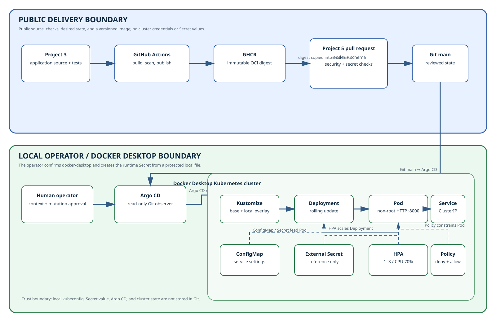

# Architecture

## Purpose and boundaries

This repository is the platform desired-state repository for the
`containerised-service-cicd` application.
The repositories have separate responsibilities:

| Boundary | `containerised-service-cicd` application repository | `containerised-service-gitops` desired-state repository |
| --- | --- | --- |
| Owns | Python source, tests, Dockerfile, image release | Kubernetes desired state, validation, operations |
| Produces | Versioned GHCR image | Rendered Kubernetes objects |
| Changes through | Application pull request and release | Environment pull request and reconciliation |
| Must not contain | Kubernetes deployment policy | Application source or image build duplication |

## Delivery and reconciliation flow

The diagram below is the source of truth for the public architecture board;
the committed SVG is suitable for GitHub and screen readers.



Edit [architecture.mmd](architecture.mmd) when the flow changes, then
regenerate `architecture.svg` with a Mermaid renderer and review the SVG's
accessible title and description.

## Repository layout

```text
apps/containerised-service/
  base/
  overlays/local/
  overlays/staging/
argocd/
  applications/
docs/
  decisions/
  issues/
scripts/
```

`base` contains reusable workload intent. Overlays express only environment
differences. Argo CD configuration points at an overlay rather than duplicating
rendered YAML.

## Trust boundaries

- GitHub is public and therefore contains no sensitive values.
- GHCR supplies a public, versioned application artifact.
- The local kubeconfig and cluster credentials remain outside Git.
- Argo CD reads this repository; it receives no write credential.
- Secret values are created out of band in the local cluster and only their
  object/key references appear in desired state.
- Pull-request CI validates but cannot deploy.

## Quality attributes

- **Reviewability:** environment changes are visible as small Git diffs and
  rendered output.
- **Reproducibility:** Kustomize generates the same desired state from the same
  revision.
- **Least privilege:** the pod is non-root, receives no unnecessary API token,
  and has minimal network access.
- **Diagnosability:** operations begin with status, events, logs, and rendered
  configuration.
- **Recoverability:** a known-good Git revision is the rollback source.
- **Portability:** the configuration avoids cloud-specific resources.

## Evolution constraints

Do not add a cloud cluster, ingress controller, service mesh, secret manager,
progressive-delivery controller, or multi-cluster promotion merely to resemble
production. Each changes the security or operating boundary and requires a
separate decision and maintainer approval.
